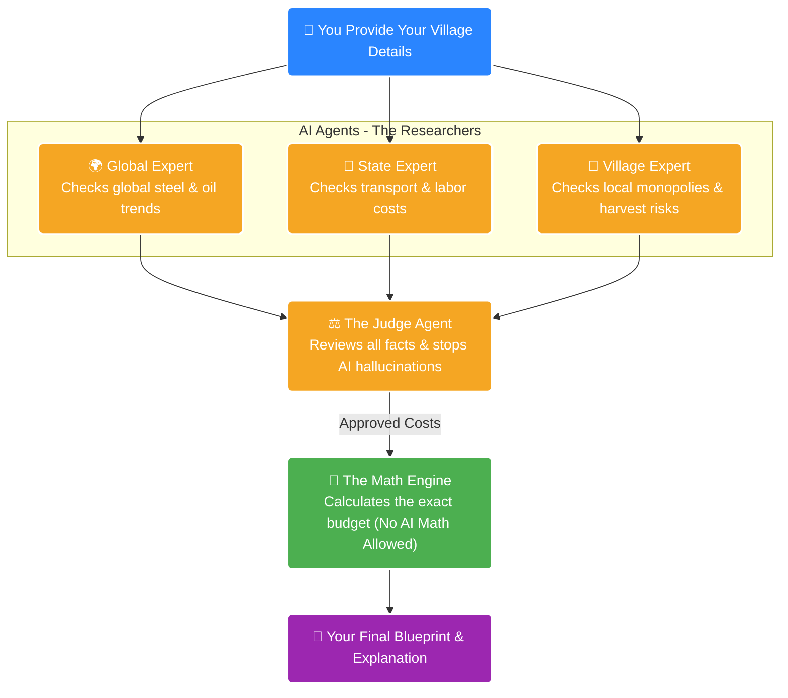

# ApnaGharAI

> **Smart Estimation for Tomorrow's Construction.**

[](https://apnagharhogaai.vercel.app/)

**[🚀 Try the Live App Here!](https://apnagharhogaai.vercel.app/)**

ApnaGharAI is a reality-aware estimation engine for rural and semi-urban home construction. Unlike standard calculators that simply multiply square footage by a base rate, ApnaGharAI utilizes a true Multi-Agent system to scrape live market data, calculate local friction (monopolies, logistics, weather delays), and provide a mathematically certain financial blueprint.

## 💡 Why This Project is Important
1. **Solves a Real Financial Crisis:** Families often run out of money mid-construction because standard calculators ignore hidden, real-world costs like local monopolies, bad roads, and monsoon delays. This tool prevents that by estimating the true "friction cost" of building.
2. **Fixes AI "Math Hallucinations":** Standard AI models are terrible at math. By forcing the AI agents to only gather real-world data and letting a strict Python engine handle the calculations, this project proves that AI can be trusted with complex financial budgets without making up numbers.

## 🏗️ Architecture: The "Split Engine"

To prevent AI mathematical hallucinations, the architecture strictly separates reasoning from math. Here is how the system works behind the scenes:



1. **The Observers (AI Agents):** Three parallel agents (Macro, Regional, Micro) use DuckDuckGo to scrape live web data regarding geopolitical commodity shocks, state-level logistics, and village-level harvest cycles.
2. **The Safety Net (Python Clamps):** AI proposals are piped through strict, dynamic Python constraints to prevent wild hallucinated numbers from destroying the budget.
3. **The Synthesizer (Judge Agent):** Synthesizes the data, applies circuit breakers (e.g., DIY labor nullifies weather delay costs), and generates a plain-English transcript.
4. **The Calculator (Deterministic Math Engine):** A strict Python FastAPI/Pydantic engine that computes the final cost and monthly savings goals with absolute mathematical certainty.

## 🚀 Tech Stack & Deployment
- **Frontend (Deployed on [Vercel](https://apnagharhogaai.vercel.app/)):** React (Vite), JavaScript, Vanilla CSS (Glassmorphism architecture).
- **Backend (Deployed on Render):** Python, FastAPI, Uvicorn, Pydantic.
- **AI Engine & LLMs:** LangChain, DuckDuckGo API.
  - **Cloud LLM:** `meta-llama/llama-3.1-8b-instruct:free` (via OpenRouter).
  - **Local LLM:** `gpt-oss:120b` (via Ollama).
  - **Orchestration:** Python `asyncio` for true parallel multi-agent execution.

---

## 💻 How to Run Locally

You will need to open **two separate terminal windows** to run the backend server and the frontend interface simultaneously.

### 1. Start the FastAPI Backend
```bash
cd backend
source venv/bin/activate  # Or `venv\Scripts\activate` on Windows
uvicorn main:app --reload --port 8000
```
*The backend will run on `http://localhost:8000`*

### 2. Start the React Frontend
```bash
cd frontend
npm install  # If running for the first time
npm run dev
```
*The frontend will run on `http://localhost:5173`*

---

## 🔑 Environment Variables
In the `/backend` directory, create a `.env` file (you can copy `.env.example`) and configure your LLM keys:
```env
OPENROUTER_API_KEY="your_openrouter_key"
# Optional Local LLM Fallback
OLLAMA_BASE_URL="http://localhost:11434"
```
